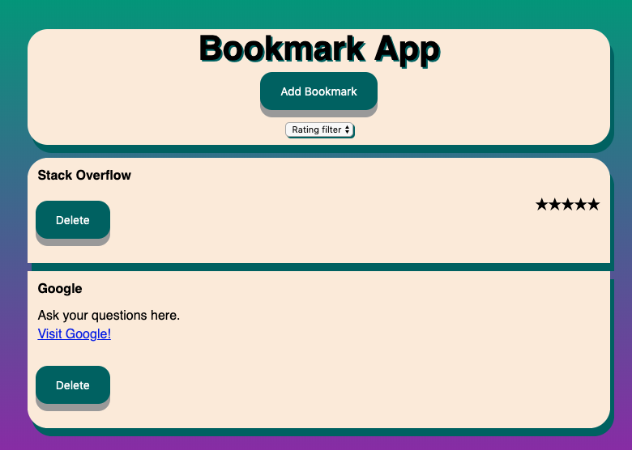

# Bookmark App  

*This is application was made by Matthew Nguyen and William Wong*  

[Demo](https://thinkful-ei-armadillo.github.io/will-matt-bookmark/)

## Summary  
This is a simple web application that allows the users to save/rate their favorite bookmarks. The app was bulit so I could have a way to consolidate and rate all the sites I frequently visit. It was made with HTML, CSS, and Javascript.  

## Tech Stack  
HTML, CSS, and Javascript  